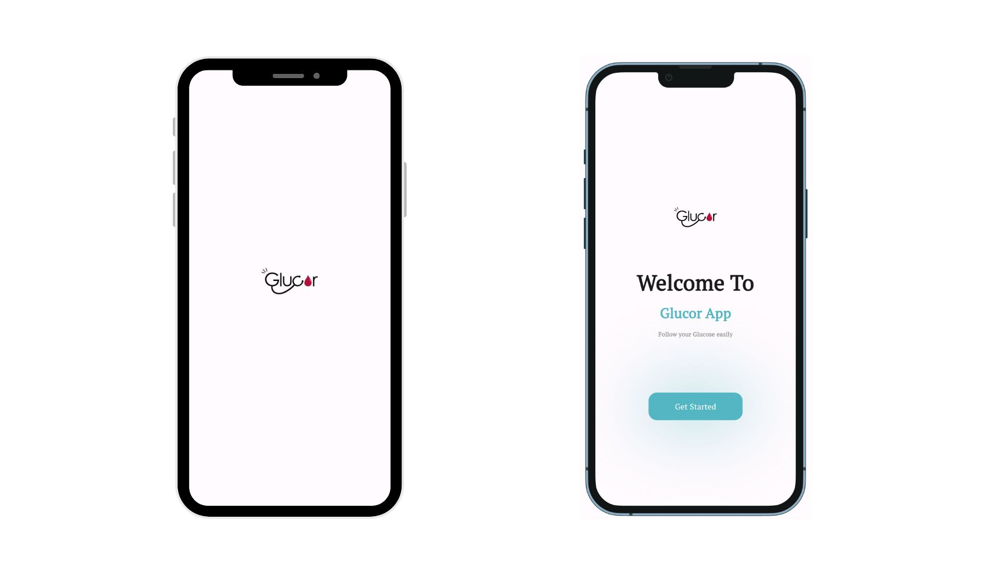

<p align="center">
  
</p>


## Content
 - [Description](#description)
 - [Features](#features)
 - [Tools](#tools)
 - [Screenshots](#screenshots)
 - [APK Path ](#apk-path )


## Description

The Glucose Monitoring Application is a comprehensive health management tool designed to work with smartwatches. It monitors glucose levels, heart rate, and other personal health data, offering real-time alerts and a range of interactive features. The app supports seamless communication with healthcare professionals and provides a detailed overview of your health metrics.


## Features

- Real-Time Glucose Measurement Display: Monitors and shows current glucose levels directly from the smartwatch.
- Heart Rate Monitoring: Tracks heart rate continuously and displays it in real-time.
- Historical Glucose Data: Stores and displays past glucose measurements for trend analysis.
- Data Visualization: Generates charts and graphs showing glucose and heart rate data over a customizable time period (e.g., 12 hours, 24 hours).
- Personal Health Data Management: Allows users to input and manage personal health information, including medical history and current medications.
- Doctor Consultation: Provides a secure chat feature to communicate with healthcare professionals directly from the app.
- Integrated Chatbot: Offers a virtual assistant for answering common questions about health and app functionalities.
- Emergency Alerts: Sends notifications if glucose levels are higher or lower than the set thresholds.
- Emergency Contact Notification: Automatically calls or sends alerts to designated emergency contacts if the user experiences a fainting episode or other critical events.
- Customizable Alerts: Users can set their own thresholds and types of alerts for glucose levels and heart rate.
- Medication Reminders: Sends reminders for taking medications or other health-related actions based on user preferences.
- Sync with Smartwatch: Seamlessly integrates with smartwatches to collect and sync data, ensuring accurate monitoring.
- Health Trends Analysis: Analyzes and provides insights into long-term health trends based on collected data.
- User Profiles: Supports multiple user profiles for families or caregivers, each with individualized settings and data.
- FAQ and Help Section: Includes a comprehensive FAQ section to help users understand app features and troubleshoot common issues.
- Integration with Health Devices: Supports integration with other health devices and applications for a holistic view of health data.
- Privacy Controls: Provides robust privacy settings to control data sharing and ensure user data security.
- Data Backup and Restore: Offers functionality to back up user data to the cloud and restore it as needed.


## Tools


## Screenshots





## Deployment

To deploy this project run this command in terminal

```bash
 flutter build apk
```

## APK Path 
build/app/outputs/flutter-apk/app-release.apk


## Contact
For any questions or feedback, please reach out to:

Email: MazenOthman320@gmail.com
